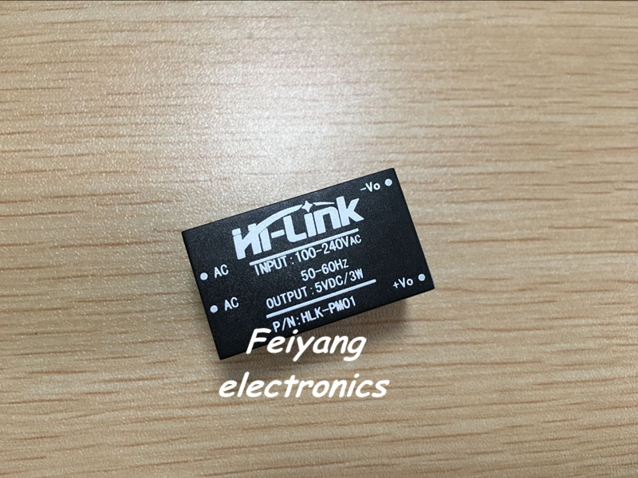
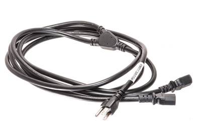
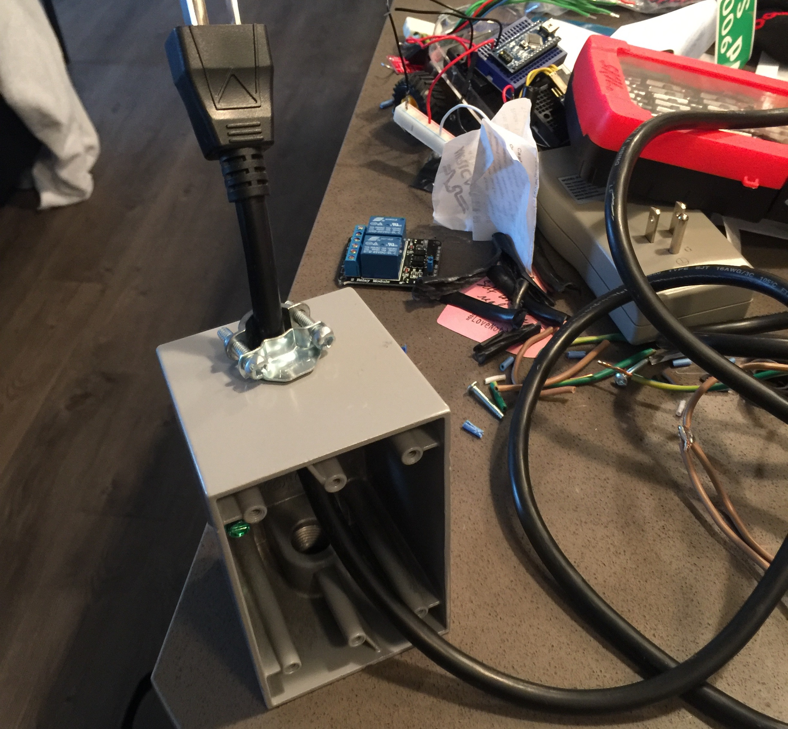
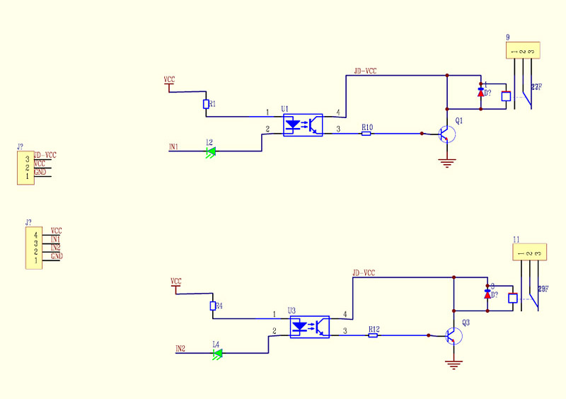
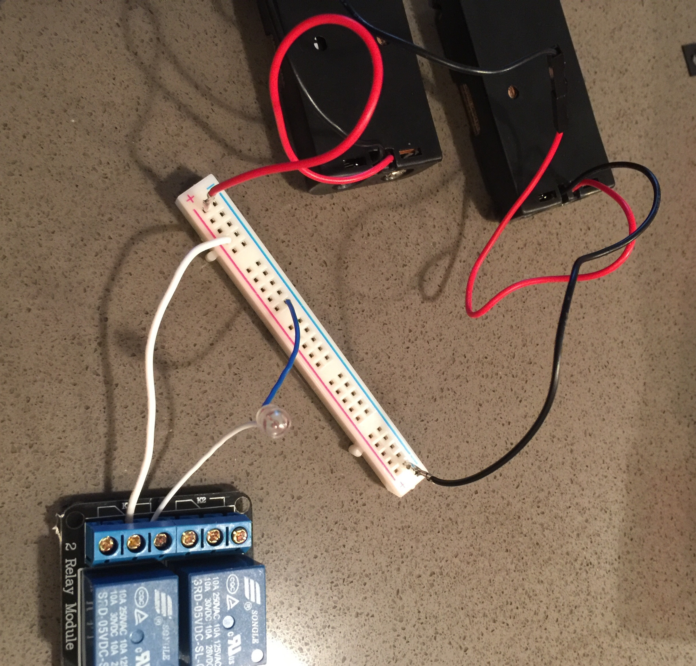
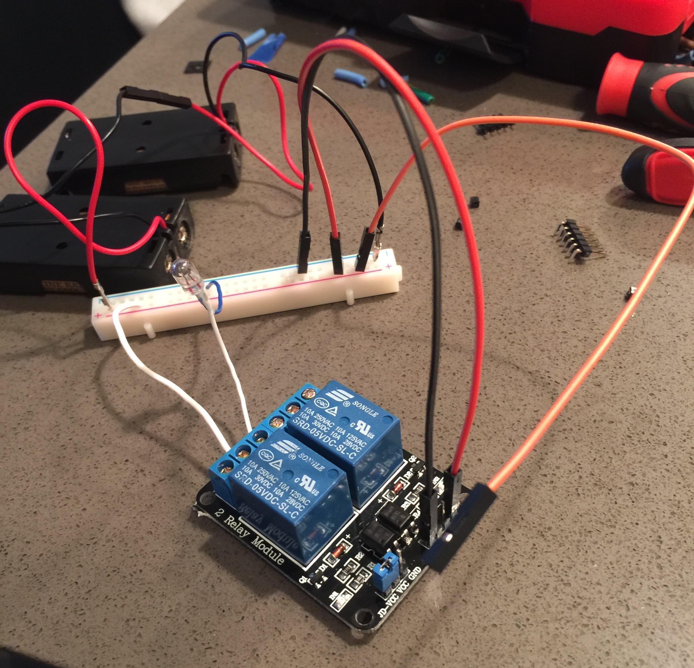

# Smart Outlet
The purpose of this project is to use a ESP8266-backed [WeMos](http://www.wemos.cc) chip and a 2-relay interface board inside an extra-deep single-gang box to create a smart electrical outlet. 

## Background
I occasionally mine bitcoin (when I have electricity included in my rent). My bitcoin miner uses 1300 watts—that's a lot!

The miner has two power supplies, each drawing nearly 5.5 amps. When plugging in the machine, the top power supply must be plugged in first, followed by the bottom power supply within three seconds. This is to allow the top power supply to power on the beaglebone controller and one of the mining boards and give them time to be ready for the second mining board to come online. This gave me the idea to use an arduino chip that would, when given the signal, power on one outlet and the second one within three seconds. 

I also have a [Nest Learning Thermostat](https://nest.com/thermostat/meet-nest-thermostat/), which offers an API and wireless connectivity. Since my bitcoin miner sounds like a vaccum cleaner and puts off the heat of a space heater, it seemed like a cool project to have my bitcoin miner and my Nest thermostat talk to each other and coordinate the heating/cooling of my apartment. In my mind, it would go something like this:
* Nest has learned that I usually leave my apartment at 8:45am. It turns off the A/C. 
* My bitcoin miner is notified that the A/C is off and it's ok to heat up the apartment by mining bitcoin. It powers up.
* Nest knows that I usually get home around 6pm and that it can cool my apartment at a rate of x degrees per hour. It figures out what time to turn on the A/C to begin cooling, and powers on then.
* My bitcoin miner is notified that the A/C is on, and that it should stop mining so that it's not fighting the A/C. It powers off.

At my work, we have been learning about arduino boards and building robots in a mechatronics group brown-bag lunch every Friday. I ordered some ESP8266-backed [WeMos](http://www.wemos.cc) chips because they looked like the perfect chip for my idea. I could hook that up to a 2-channel relay interface board to turn on and off the two independently-switched outlets on my single-gang electrical box.

## Tools & Supplies
* Liquid Tape

* 2-channel relay interface board from [SainSmart](http://www.sainsmart.com/sainsmart-2-channel-5v-relay-module-for-arduino-raspberry-pi.html)

* [WeMos D1-mini](http://www.wemos.cc/Products/d1_mini.html) (Two are pictured here for a top & bottom view)

* a [HLK-PM01 AC-DC 220V to 5V Step-Down Power Supply Module Intelligent Household Switch Power Supply Module](http://www.aliexpress.com/item/10pcs-HLK-PM01-AC-DC-220V-to-5V-Step-Down-Power-Supply-Module-Intelligent-Household-Switch/32320072459.html)

* a power cable/extension cord capable of handling at least 15 amps—I used a computer power cable that was forked like this:

* an extra-deep single gang electrical box and clamp connector (I bought at Home Depot)

* a cheap electrical outlet

* solder
* soldering iron
* wire cutters
* wire strippers
* phillips screw driver
* pliars
* multimeter
* 2 3-volt AA battery packs
* various jumper wires
* 6V, 50mA miniature lamp

##Software
* Arduino IDE or C Lion & Platformio
* `smart-outlet.cpp`

#Steps
##Step 1: Prepare the power cable
* Cut off the end of the power cable that is farthest from where you'd plug it in the wall
* Screw in the clamp connector to the hole in the top of the gang box
* Feed the cut-off end through the hole and clamp connector in the gang box, from the outside of the box toward the inside.
* Push the gang box all the way to the end of the power cable (the end where you plug it in to the wall). This will give you room to work on the other end of the cable.

* Strip off the cable shielding to reveal the hot, neutral, and ground wires. Use the continuity function of the multimeter to verify which wire is hot, which is neutral, and which is ground. In my case, the green wire is ground, the blue wire is neutral, and the brown wire is hot. You use this diagram to make sure you get it right:

* There's a brass tab on each side of the outlet: the left side tab connects the neutral terminal for the top outlet and the neutral terminal for the bottom outlet, while the right side tab connects the hot terminal for the top outlet and the hot terminal for the bottom outlet. This causes the outlets to be switched together. Since we want the two outlets to be powered independently, we want to break the tab off on the right (hot) side. Grab right tab with pliars and bend it back and forth until it breaks off. Leave the left (neutral) tab intact.

##Step 2: Test the relays
* Checkout the diagram for the relays:

* On the right side of the diagram, we see two yellow boxes with numbers 1, 2, and 3.
* These yellow boxes correspond to the two relay terminals (the blue strip of plastic with screws in it, labeled K1 and K2)
* There are three lines coming out of the yellow boxes that go down. If we follow them, we see that line 2 and line 3 are connected, with line 1 disconnected. Relays work by applying a signal to an electromagnet and connecting (here) lines 1 and 2. Think of the end of line 2 as being on a pivot that normally rests connecting lines 2 and 3, and the little blue box next to line 1 as being an electromagnet that (when a signal is applied) pulls on the end of line 2, which pivots away from line 3.
* The yellow boxes on the left side of the diagram correspond to the inputs to the relay board. The bottom yellow box shows line 4 is VCC, or 5V in, and line 1 is ground. Line 3 is signal input 1 (for relay K1) and line 2 is signal input 2 (for relay K2). Signal inputs 1 and 2 will come from the WeMos digital out pins. 
* The question remains, however: does a high signal in or a low signal in cause the relay to switch? We should test it! 
* Here I have a 6-volt 50mA Miniature Lamp and two 3-volt AA battery packs hooked up in series to produce 6V. We'll use the batteries to power the lamp. Notice that the lamp blue lead is common/ground, and the lamp white lead is VCC.

* We'll add in the relay in its default, powered-off state, and connect the blue lamp lead to ground and the white lamp lead to diagram terminal 3. We add a white jumper wire to diagram terminal 2 and to VCC of the batteries. We see that the lamp is powered on, verifying that diagram terminals 3 and 2 are normally connected, closing the circuit.

* Now we remove the white lamp lead from its relay terminal and connect it to diagram terminal 1. We also remove the jumper wire from diagram terminal 3 and connect it to diagram terminal 2. We see that the lamp is off, verifying that diagram terminals 1 and 2 are normally disconnected, leaving that circuit open.

* Now we want to verify the behavior of the relay. We will power the relay board with the battery packs as well (I probably shouldn't have put 6 volts through a 5V relay board, but I did. Luckily it didn't burn up). We leave the lamp as it is currently connected (this is the setup we want: the circuit will be normally open—diagram terminals 1 and 2 are disconnected—then we apply a signal to connect 1 and 2, thus closing the circuit). We connect a jumper wire from the battery VCC to VCC in on the relay board (the bottom left yellow box on the diagram, line 4). We also connect a jumper wire from the battery ground to the ground on the relay board (the bottom left yellow box on the diagram, line 1). Lastly, we connect a jumper wire from battery ground to signal input 1 (the bottom left yellow box on the diagram, line 3). You should hear a click and see the lamp turn on! Removing the signal should also click and the lamp should turn off. This was just a guess—a low signal activates the relay. I'm not an electrical engineer and don't know how to read the complete diagram (though I'm learning!). We could have just as easily connected the battery VCC to signal 1 input; we would have seen nothing happen and tried connecting signal 1 input to ground, which would show the correct behavior.

